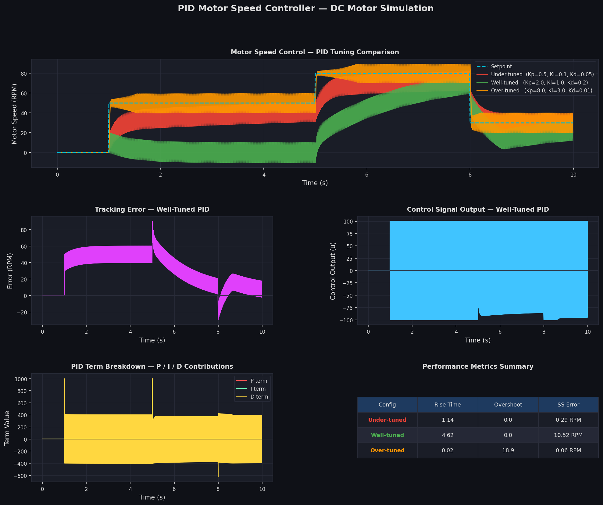

# PID Motor Speed Controller — DC Motor Simulation

A control systems project simulating a **PID (Proportional-Integral-Derivative) controller** applied to a DC motor speed control problem, with three tuning configurations compared side by side.

## What it does

- Models a **DC motor** as a first-order dynamic system (transfer function: `K / (τs + 1)`)
- Implements a **discrete-time PID controller** with anti-windup protection
- Simulates **multi-step setpoint tracking** (50 RPM → 80 RPM → 30 RPM)
- Compares **three tuning strategies**: under-tuned, well-tuned, over-tuned
- Visualizes P / I / D term contributions, tracking error, and control signal output
- Calculates performance metrics: rise time, overshoot, and steady-state error

## Output



### Plots generated:
| Panel | Description |
|-------|-------------|
| Top | Motor speed vs. setpoint — all three PID configs |
| Middle left | Tracking error over time (well-tuned) |
| Middle right | Control signal output (well-tuned) |
| Bottom left | P / I / D term breakdown |
| Bottom right | Performance metrics table |

## Requirements

```
numpy
matplotlib
```

Install with:
```bash
pip install numpy matplotlib
```

## Usage

```bash
python pid_simulation.py
```

## System Parameters

| Parameter | Value | Description |
|-----------|-------|-------------|
| Motor gain K | 10.0 | RPM per unit input |
| Time constant τ | 0.5 s | Motor lag |
| Simulation step dt | 0.01 s | Euler integration step |
| Setpoints | 50 → 80 → 30 RPM | Multi-step reference |

## PID Configurations Compared

| Config | Kp | Ki | Kd | Behavior |
|--------|----|----|----|----------|
| Under-tuned | 0.5 | 0.1 | 0.05 | Slow response, high steady-state error |
| Well-tuned | 2.0 | 1.0 | 0.2 | Fast tracking, minimal overshoot |
| Over-tuned | 8.0 | 3.0 | 0.01 | Oscillatory, unstable transient |

## Concepts Covered

- **PID control theory** — P, I, D term roles and tuning effects
- **Anti-windup** — Integral clamping to prevent actuator saturation
- **First-order system modeling** — Euler discretization of continuous transfer functions
- **Performance metrics** — Rise time, overshoot, steady-state error
- **Time & frequency domain analysis**

## About

Developed as part of EEE coursework at Özyeğin University.  
Focused on understanding closed-loop control systems and the practical effects of PID tuning on dynamic system behavior.
